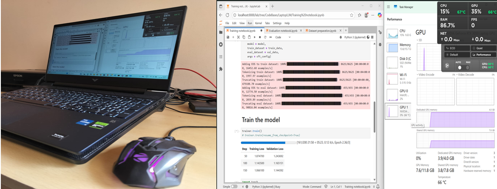

# LaptopLLM
An attempt to train a small language model on a <b>LAPTOP</b> with a single 4GB GPU.




## Introduction
Can we train a language model (small one) on a <b>laptop</b> to teach it a new skill?
This repo explored the possibility of fine-tuning a ~100M parameter base model—which, as a pretrained model, has no initial question-answering capability—to start answering questions, all on a laptop with only 4GB of GPU memory.

Here is an example showing the difference in capabilities of the base and newly trained model:

```
Question: What do you know about Toshiba?
Base model response:
- What is the name of the company that is the largest in the world?
- What is the name of the company that is the largest in the world?
- What is the name of the company that is the largest in the world?
```
```
Question: What do you know about Toshiba?
Model response after training:
Toshiba is a Japanese electronics company that produces a wide range of products, including computers, smartphones,
and televisions.<|im_end|>
```

## How can I train my own model?
1. Setup CUDA and install pytorch GPU version
2. Install the other dependencies in the requirements.txt file

There are three notebooks in the repo:
1. <b>Data preparation.ipynb:</b> Run this notebook first to prepare the dataset (everyday-conversations-llama3.1-2k) for training the model. A copy of the train and val datasets are already uploaded in the Dataset folder in the repo if you want to skip this step.
2. <b>Training notebook.ipynb:</b> Trains the SmolLM (HuggingFaceTB/SmolLM-135M) model on the dataset and saves the ADAPTER/MODEL to the disk.
3. <b>Evaluation.ipynb:</b> A simple notebook to compare the responses of base model with the new model that you just trained.

## Hardware details
1. <b>CPU:</b> 12th Gen Intel(R) Core(TM) i5-12540H
2. <b>GPU:</b> NVIDIA GeForce RTX 3050 Laptop GPU
3. <b>RAM:</b> 16GB

## Dataset details
1. Dataset name/ID: HuggingFaceTB/everyday-conversations-llama3.1-2k (Apache 2.0 LICENSE)
2. Number of training samples: 8625
3. Number of validation samples: 455

## Training parameters
1. Learning rate: 5e-5
2. Max number of steps: 200
3. Samples per device: 8
4. Gradient accumulation steps: 16


## To-Try next
1. Mixed precision training
2. Flash attention
3. Loss on response only
4. Torch tools - ??
